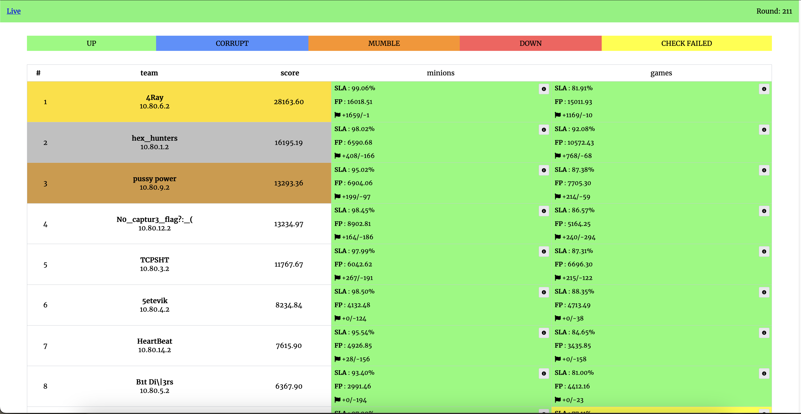

# Attack-Defense Train 2024 

Мероприятие проходило 26.12.2024. Организаторы - РТУ МИРЭА и [cR4.sh](https://ctftime.org/team/224675)

Репозиторий с чекерами, сервисами и сплойтами.

## Results

TODO: Add scoreboard!

[Full scoreboard](scoreboard/full.png)

## Services

| Service | Language | Checker | Sploits | Authors |
|---------|----------|---------|---------|---------|
| **[games](services/games/)** | Python | [Checker](checkers/games/) | [Sploits](sploits/games/) | [@S4ar](https://t.me/XxX_S4ar_XxX) |
| **[minions](services/minions/)** | C | [Checker](checkers/minions/) | [Sploits](sploits/minions/) | [@FrakenboK](https://t.me/FrakenboK) |
   
## Infrastructure

- DevOps: [@cotsom](https://t.me/cotsom) и [@S4ar](https://t.me/XxX_S4ar_XxX)
- Checksystem: [ForcAD](https://github.com/pomo-mondreganto/ForcAD)